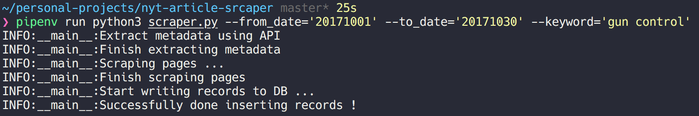

Web Scraping New York Times Articles 
------------------------

## Scraper 



Scraper is a class for collecting article data from New York Times based on query keyword. First, this will fetch article meta data such as "page url", "keywords" and "type of material" through NYT [article search API](https://developer.nytimes.com/article_search_v2.json). Next, starts scraping article contents by given page url. 

For analytical use, collected dataset will be stored in local mongoDB. It is true that this is not the best way to save long text in a single field, but one, body contents are not that large and two, it is implemented as personal academic use. So, Only thing you need is to modify `scrape_and_save` code to whatever storage that suits you.  


## Install 
#### Authentification 
Get your NYT API key [here](https://developer.nytimes.com/) and set an environment variable as below.
```
# bash_profile or other profile script based on whatever shell you use   
vim ~/.bash_profile 
export NYT_API_TOKEN=your-api-key-here
source ~/.bash_profile 
```

#### Set up local mongo DB
You need to set up a mongoDB(community edition) in your local environment. If you're on mac, you can easily install with homebrew. 
```

brew update  
brew install mongodb

# make directory where files locate
mkdir -p /data/db

# check permission
sudo chown -R `id -un` /data/db
```
Now you can run mongoDB
```
# start mongoDB  
brew services start mongodb 

# try this in order to check if it listens  
brew services list | grep mongodb

# stop mongoDB
brew services stop mongodb
```

By default, dbPath: `/usr/local/var/mongodb`, config path: `/usr/local/etc/mongod.conf`, 
system log path: `/usr/local/var/log/mongodb/mongo.log`

If you are not on mac, visit [here](https://docs.mongodb.com/manual/administration/install-community/)  

#### Install requirements 
```
pipenv install
```

## Usage 
You need to give a specific words to search article and dates to limit the range.  
Date has YYYYMMDD format. Result dataset will stored in mongodb(db name:'nytimes', collection name: 'articles')


```
usage: [-h] --from_date FROM_DATE --to_date TO_DATE --keyword KEYWORD

cli argument for scarping articles

optional arguments:
  -h, --help            show this help message and exit
  --from_date FROM_DATE
                        date query articles from
  --to_date TO_DATE     date query articles to
  --keyword KEYWORD     keyword to query articles
``` 


#### For Scraping 
For example, If you want to search articles about 'gun' during the first 3 months of 2017, then 
run as follows. 
```
pipenv run python3 scraper.py --from_date='20170101' --to_date='20170331' --keyword='gun control'
```

#### Getting data from mongoDB as a dataframe object 
```python
# get db client 
import pymongo 
from pymongo import MongoClient
client = MongoClient()
db = client.nytimes
collection = db.articles

# make dataframe out of mongoDB
# columns in the collection
columns =  ['_id', 'web_url', 'pub_date', 'document_type', 
		'type_of_material', 'word_count', 'keywords', 'query', 'text']
df = pd.DataFrame(list(db.articles.find()), columns=columns)
``` 


